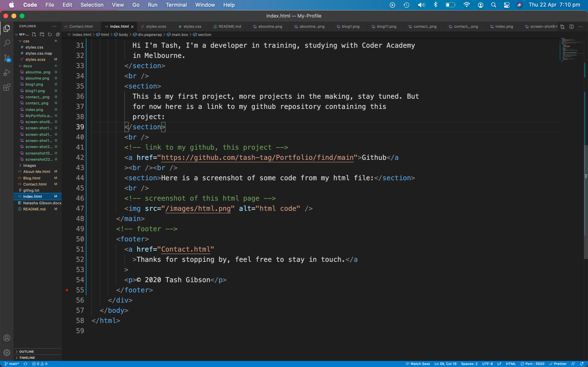

# Portfolio Tash Gibson
## **Link to published website:**
https://naughty-poincare-aa48c3.netlify.app
## **Link to Github repo:**
https://github.com/tash-tag/Portfolio
## *Description of portfolio website:*
## **Purpose**
Welcome, this is my first project, it is a portfolio representing my skills, interests, professional knowledge and my work as an aspiring Web Dev so far.
## **Functionality/features**
The website's features are 
* nav bar - to navigate to other pages
* box - contains information, links and icons
* pagewrap - forms a space around all content
* footer and header
* main - contains text and icons
* section - contains a form
* button - link to top of page and submit button
* form - to enter contact details and message
* article - contains icons and links
## **Sitemap**
This is a sitemap created at the start of the project, the Home page is the index page and all pages connect to on another via a nav bar.

## **Screenshots of code**

## **Target audience**
The target audience for this project is an employer looking to engage a dev or IT professional.
## **Tech stack**
* html
* css
* scss
* README.md file
* Netlify - deployment site
* Github
* Terminal
* VSCode
* Trello board - trello.com
* Sitemap - app.diagrams.net
* Wireframes - Balsamiq
## **Trello Screenshots**

